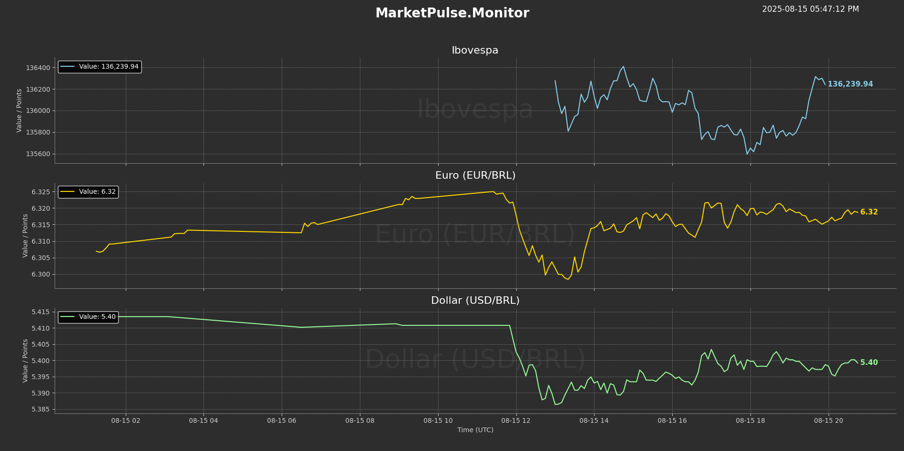

# MarketPulse.Monitor

[](https://www.python.org/)
[](https://opensource.org/licenses/MIT)

A real-time charting application to monitor key financial assets, built with Python.

## Demo



## Key Features

- Live chart that updates automatically.
- Clean, dark-themed UI inspired by professional trading platforms.
- Tracks multiple assets simultaneously in a clear, organized dashboard.
- Includes a real-time clock and dynamic labels showing the latest price directly on the chart.
- Y-axis adjusts smoothly to the day's price range for better readability.

## Technologies Used

- Python 3
- yfinance
- Pandas
- Matplotlib & Seaborn

## Setup and Installation

To run this project locally, follow these steps:

1.  **Clone the repository:**
    ```bash
    git clone [https://github.com/SEU-USUARIO/MarketPulse.Monitor.git](https://github.com/SEU-USUARIO/MarketPulse.Monitor.git)
    cd MarketPulse.Monitor
    ```

2.  **Create and activate a virtual environment:**
    * On macOS/Linux:
        ```bash
        python3 -m venv venv
        source venv/bin/activate
        ```
    * On Windows:
        ```bash
        python -m venv venv
        venv\Scripts\activate
        ```

3.  **Install the required dependencies:**
    ```bash
    pip install -r requirements.txt
    ```

4.  **Run the application:**
    * On macOS/Linux:
        ```bash
        python3 src/monitor.py
        ```
    * On Windows:
        ```bash
        python src\monitor.py
        ```

<br>

<details>
<summary><h3>Project Evolution / Evolução do Projeto</h3></summary>

---
#### **v3.3**
- Added a dynamic value label that follows the plot line.
- Implemented stable Y-axis limits that adjust to the day's price range.
- Added a subtle watermark of the asset's name to each chart.
- Moved the real-time clock to the top-right corner and set it to 12-hour (AM/PM) format.
- Re-added the static legend box for constant reference.

#### **v3.0**
- Implemented a major visual overhaul with a new professional dark theme.
- Added a real-time clock, updating every second, as a live indicator.
- Refined code with type hinting and more concise comments.

#### **v2.0**
- Rebuilt the project's structure using an Object-Oriented approach.
- Implemented real-time chart updates, transforming the tool from static to dynamic.
- Created a separate version for compatibility with notebook environments (like Google Colab).

#### **v1.0**
- Initial version of the project.
- Fetched financial data and generated a single, static chart.

---
</details>

<br>

## Author

- **[Alexis Barragam]** - [LinkedIn Profile](https://www.linkedin.com/in/alexisbarragam/)